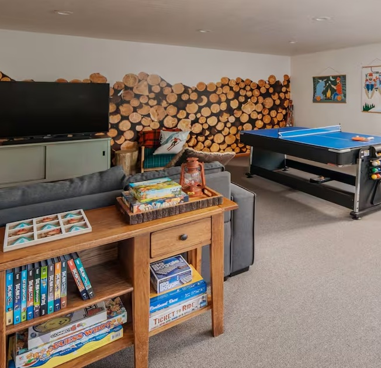

# Photo Setup Guide — Lay-Z Bone Lodge

Place all photo files in the `photos/` folder next to this file.
The site will automatically display them — no code edits required for gallery photos.

---

## Gallery Photos (8 slots)

Save each photo with the exact filename shown below.
The site picks them up via the `data-src` attribute on each gallery tile.

| Filename | Gallery Slot | Notes |
|---|---|---|
| `photos/kitchen-dining.jpg` | Kitchen & Dining | Wide shot, 16:10 ratio ideal |
| `photos/master-bedroom.jpg` | Master Bedroom | King bed, natural light |
| `photos/fireplace.jpg` | Fireplace | Living room with fireplace lit |
| `photos/game ` | Jetted Tub | Bathroom / tub area |
| `photos/bunk-room.jpg` | Bunk Room | Kids room with bunk beds |
| `photos/deck-views.jpg` | Deck & Views | Outdoor deck, wide shot |
| `photos/game-room.jpg` | Game Room | Game table, arcade, 65" TV |
| `photos/exterior.jpg` | Exterior | Outside of the lodge |

**Recommended specs:** JPEG, 1800–2400px wide, under 500 KB each.
Use [Squoosh](https://squoosh.app) or [TinyJPG](https://tinyjpg.com) to compress before saving.

> **How it works:** Each gallery tile has `data-src="photos/filename.jpg"`. When that file exists,
> the lightbox shows the real photo. While a file is missing, the tile shows its color placeholder —
> no broken-image icons, no errors.

---

## Hero Background Photo (optional)

To replace the forest-green gradient hero with a real photo:

1. Save your photo as `photos/hero.jpg` (landscape orientation, at least 1920px wide)
2. Open `index.html` and find the `.hero-bg` rule in the `<style>` block (~line 99)
3. Change this:
   ```css
   /* background-image: url('photos/hero.jpg'); background-size: cover; background-position: center; */
   ```
   To this (uncomment and remove the gradient line above it):
   ```css
   background-image: url('photos/hero.jpg');
   background-size: cover;
   background-position: center;
   ```

---

## About Section Images (2 slots)

These are the stacked images on the right side of the "The Lodge" section.

### Main image (living room)
Find this block in `index.html` (~line 596):
```html
<div class="img-card img-main">
  <!--
    REPLACE THIS DIV with:
    
  -->
```
**Replace the entire `<div class="img-card img-main">...</div>` with:**
```html
<div class="img-card img-main">
  
  <span class="img-cap">Living Room</span>
</div>
```
Save as `photos/living-room.jpg` (4:3 ratio works best).

### Secondary image (overlapping corner card)
Find the `<div class="img-card img-secondary">` block right below it.
**Replace with:**
```html
<div class="img-card img-secondary">
  
  <span class="img-cap">Game Room</span>
</div>
```
Save as `photos/game-room-thumb.jpg` (square or close to 1:1 ratio).

---

## Adding More Gallery Photos

To add more photos beyond the 8 slots, duplicate any `.gc` block in `index.html`
and update the `data-caption`, `data-src`, and `data-gradient` attributes.
Also add the matching CSS span class (`.gc-9`, etc.) with `grid-column: span N`.

---

## Where to Download Source Photos

The original listing photos are at:
https://www.sierravacationrentals.com/vacation-rentals/lay-z-bone-lodge-central-heat

Right-click each photo in the slideshow → "Save image as" → rename to match the filenames above.
